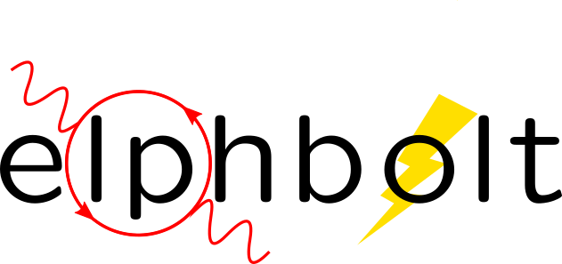

# elphbolt
`elphbolt` (short for **el**ectron-**ph**onon **Bol**tzmann **t**ransport) is a modern Fortran (2018 standard) code for solving the coupled electron and phonon Boltzmann transport equations (BTEs). It is a "free as in freedom" code distributed under the GNU Public License (GPL) version 3. You can read more about the philosophy of software freedom [here](https://www.gnu.org/philosophy/free-sw.en.html).

Using *ab initio* electron-phonon and phonon-phonon interactions and a fully wave vector and electron band/phonon branch resolved formulation of the BTEs, `elphbolt` can calculate the

- phonon and electronic thermal conductivities;
- electronic conductivity;
- phonon and electronic contributions to the thermopower; and
- effect of the mutual electron-phonon drag on the transport coefficients listed above.

Stylistically, it is designed to be simple, small, fast, and extensible. Object oriented programming concepts are combined with the procedural style, which allows fast development, while resulting in a rather compact code. The symmetries of the crystal are fully exploited and the transport active Fermi window is used to allow the sampling of extremely fine wave vector meshes needed for an accurate solution of the BTEs. Parallelism is achieved through modern Fortran's intrinsic `coarrays` feature that is fully supported by recent versions of both the `gcc` and `intel` compilers.

`elphbolt` currently interfaces with the `Quantum Espresso` suite for the phonon quantities and the `EPW` code for the Wannier space information.

The project is currently in the beta phase and being used to do publication level calculations.

## Installation on HPC systems with `gcc`

### 1. Get `spglib`

`elphbolt` uses the [`spglib`](https://spglib.github.io/spglib/) library for crystal symmetry analysis. Currently, versions 1.6.0 and 1.14.1 have been tried and tested. A lot of HPCs provide this library as a module, so check before building from source.

### 2. Get `OpenCoarrays`

[`OpenCoarrays`](http://www.opencoarrays.org/) is an implementation of the `coarrays` functionalities. Some HPC systems include it (for example MareNostrum4 and, more recently, LaPalma of the Barcelona Supercomputing Center (BSC)). In that case, load it. If not, you can build it from source. I was able to build version 2.0.0 on the LaPalma system of BSC by first loading `gcc`, `openmpi`, and `cmake`, then going into the `OpenCoarrays-2.0.0` directory and saying `./install.sh`. The executables `caf` and `cafrun` were then installed in `~/OpenCoarrays-2.0.0/prerequisites/installations/bin/`. I added the above directory to my `$PATH` in my `bashrc`.

On the Sirius cluster of Boston College, I was able to build version 2.9.2 by first loading `gnu_gcc/9.2.0`, `openmpi/4.0.5gcc9.2.0`, and `cmake/3.18.4`, then going into the `OpenCoarrays-2.9.2` directory and saying `./install.sh --with-fortran /usr/public/gnu_gcc/9.2.0/bin/gfortran --with-cxx /usr/public/gnu_gcc/9.2.0/bin/g++ --with-c /usr/public/gnu_gcc/9.2.0/bin/gcc --with-mpi /usr/public/openmpi/4.0.5gcc.9.2.0/ --with-cmake /usr/public/cmake/3.18.4/bin/cmake`. The executables `caf` and `cafrun` were then installed in `~/OpenCoarrays-2.9.2/prerequisites/installations/opencoarrays/2.9.2/bin/`. I added the above directory to my `$PATH` in my `bashrc`.

(You can change the build path with the additional argument `--install-prefix <path to build directory>` to `install.sh`.)

### 3. Create your `<title>.make` file

In the `elphbolt` src directory you will find a few `<title>.make` files. Adapt them to your own architecture. Then, in the `Makefile` include your personal `<title>.make` file at the top, commenting out any exiting one.

Once you have done the above, simply say `make`. This should build the executable `elphbolt.x` one directory above.

## Installation on HPC systems with `intel`

[Working on it.]

## Singularity image

[Considering it.]

## Tests

[Working on it.]

## Workflow

This is a transport code. And it comes after doing some DFT, DFPT, and Wannier calculations. The following quantities are the inputs for a calculation with `elphbolt`:

### Input file [required]

The input file - `input.nml` - contains the information about the crystal and the various parameters of the calculation. A full description of all the input parameters will be provided soon in the documentation. I will also provide example input files for the test materials.

### Second order interatomic force constants [required]

This comes out of the usual `ph.x` and `q2r.x` calculation from `Quantum Espresso`. This file is needed to calculate phonon quantities and must be named `espresso.ifc2`.

### Third order interatomic force constants [optional]

This file, which must be named `FORCE_CONSTANTS_3RD`, is needed to calculate the 3-ph scattering rates. This is a required file if you seek a solution of the decoupled phonon BTE or the coupled electron-phonon BTEs.

This must be provided for a solution to the phonon BTE or the coupled electron-phonon BTEs. See documentation for the code [`thirdorder.py`](https://bitbucket.org/sousaw/thirdorder/src/master/) (companion of `ShengBTE`) for how to generate this file.

### Wannier space information [optional]

These are required if you want to solve a decoupled electron BTE, include phonon-electron interaction in the decoupled phonon BTE, or solve the coupled electron-phonon BTEs.

These include the files `rcells_k`, `rcells_q`, `rcells_g`, `wsdeg_k`, `wsdeg_q`, and `wsdeg_g` which must be printed out of an `EPW` calculation. I will provide a patched `EPW/src/ephwann_shuffle.f90` code which will print these quantities out during `EPW`'s Bloch -> Wannier calculation step.

We will also need the files `epmatwp1` and `epwdata.fmt`, both of which are outputted by `EPW` after the Bloch -> Wannier calculation step. The first contains the Wannier space electron-phonon matrix elements and the second contains the Wannier space dynamical matrix and Hamiltonian.

### High symmetry **q**/**k**-path and initial **k**-vector [optional]

You need to provide a **q**/**k**-path file named `highsympath.txt` and an initial **k**-vector file named `initialk.txt` if you want the phonon dispersions, electron bands, and electron-phonon matrix elements calculated along a high-symmetry path.

## `input.nml` description

There are 5 Namelists in the `input.nml` file: `allocations`, `crystal_info`, `electrons`, `numerics`, and `wannier`. Users of the `ShengBTE` code will find the format of this file familiar. Below the keys for each Namelist are described.

### `allocations`

| `key`         | Type    | Mandatory | Default | Description                     |
|---------------|---------|-----------|---------|---------------------------------|
| `numelements` | Integer | Yes       |       0 | Number of types of basis atoms. |
| `numatoms`    | Integer | Yes       |       0 | Number of basis atoms.          |

### `crystal_info`

| `key`          | Type                                   | Mandatory | Default   | Description                                                                       |
|----------------|----------------------------------------|-----------|-----------|-----------------------------------------------------------------------------------|
| `name`            | String                             | No        | "Crystal" | Name of material.                                                                                                                                                                                                                          |
| `elements`        | String array of size `numelements` | Yes       |       'X' | Elements in the basis.                                                                                                                                                                                                                     |
| `atomtypes`       | Integer array of size `numatoms`   | Yes       |         0 | Integer tagging unique elements in the basis.                                                                                                                                                                                              |
| `masses`          | Real array of size `numelements`   | No        |      -1.0 | Masses of the basis atoms in amu. If masses are not provided, set `autoisotopes` to .True..                                                                                                                                                |
| `autoisotopes`    | Logical                            | No        |    .True. | Use isotopic mix for masses?                                                                                                                                                                                                               |
| `lattvecs`        | 3x3 real array                     | Yes       |       0.0 | Lattice vectors in Cartesian coordinates in units of nm. If `twod` is .True., the crystal must be positioned on the x-y plane and the third lattice vector must be of the form (0 0 layer thickness).                                      |
| `basis`           | 3x`numatoms` real array            | Yes       |       0.0 | Atomic basis vectors in crystal coordinates (i.e. fraction of `lattvecs`).                                                                                                                                                                 |
| `polar`           | Logical                            | No        |   .False. | Is the system polar?                                                                                                                                                                                                                       |
| `born`            | 3x3x`numatoms` rank-3 real tensor  | No        |       0.0 | Born effective charge tensor (from phonon calculation).                                                                                                                                                                                    |
| `epsilon`         | 3x3 rank-2 real tensor             | No        |       0.0 | High-frequency dielectric tensor (from phonon calculation).                                                                                                                                                                                |
| `read_epsiloninf` | Real                               | No        |   .False. | Read high-frequency dielectric constant from input?                                                                                                                                                                                        |
| `epsiloninf`      | Real                               | No        |       0.0 | High-frequency scalar dielectric constant. If `read_epsiloninf` is .True. (.False.), this is read from the input (set equal to the trace-average of `epsilon`). Currently this quantity is not used in any calculation.                    |
| `epsilon0`        | Real                               | No        |       0.0 | Static scalar dielectric constant. Used for screening electron-charged impurity interaction, if included. Look up `elchimp` under the Namelist `numerics`. For the default value of `epsilon0`, the electron-charged interaction blows up. |
| `T`               | Real                               | Yes       |   -1.0_dp | Crystal temperature in K.                                                                                                                                                                                                                  |
| `twod`            | Logical                            | No        |   .False. | Is the system (quasi)-2-dimensional? See description of `lattvecs` also.                                                                                                                                                                   |
| `subs_masses`     | Real array of size `numelements`   | No        |       0.0 | Masses of substitution atoms in amu. This is needed if `phsubs` is .True. See table of keys for Namelist `numerics`.                                                                                                                       |
| `subs_conc`       | Real array of size `numelements`   | No        |       0.0 | Concentration of the substitutional atoms in cm-3 (or cm-2 if `twod` is .True.). This is needed if `phsubs` is .True. See table of keys for Namelist `numerics`.                                                     |

### `electrons`
| `key`          | Type                                   | Mandatory | Default   | Description                                                                       |
|----------------|----------------------------------------|-----------|-----------|-----------------------------------------------------------------------------------|
| `spindeg`          | Integer                      | No        |             2 | Spin degeneracy of the bands.                                                                                                                                             |
| `enref`            | Real                         | Yes       | -999999.99999 | Electron referenc energy in eV. This is the center of the transport active window. Also see description for `fsthick`. See table of keys for Namelist 'numerics'.         |
| `chempot`          | Real                         | Yes       | -999999.99999 | Chemical potential in eV.                                                                                                                                                 |
| `metallic`         | Logical                      | No        |       .False. | Is the system metallic?                                                                                                                                                   |
| `numbands`         | Integer                      | Yes       |             0 | Total number of electronic Wannier bands.                                                                                                                                 |
| `indlowband`       | Integer                      | Yes       |             0 | Lowest transport band index.                                                                                                                                              |
| `indhighband`      | Integer                      | Yes       |             0 | Highest transport band index.                                                                                                                                             |
| `indlowconduction` | Integer                      | No        |             0 | Lowest conduction band index. For `metallic` .True., this or `indhighvalence` must be provided.                                                                           |
| `indhighvalence`   | Integer                      | No        |             0 | Highest valence band index. For `metallic` .True., this or `indlowconduction` must be provided.                                                                           |
| `dopingtype`       | Character                    | No        |           'x' | Type of doping ('n' or 'p'). This is needed for `runlevel` 0 only. See table of keys for Namelist 'numerics'.                                                             |
| `numconc`          | Integer                      | No        |           100 | Number of carrier concentration points. This is needed for `runlevel` 0 only. See table of keys for Namelist 'numerics'.                                                  |
| `conclist`         | Real array of size `numconc` | No        |           0.0 | List carrier concentrations in cm-3 (or cm-2 if `twod` is .True.). This is needed for `runlevel` 0 only. See table of keys for Namelist 'numerics'. |
| `numT`             | Integer                      | No        |           100 | Number of temperature points. This is needed for `runlevel` 0 only. See table of keys for Namelist 'numerics'.                                                            |
| `Tlist`            | Real array of size `numT`    | No        |           100 | List of temperatures in K. This is needed for `runlevel` 0 only. See table of keys for Namelist 'numerics'.                                                               |
| `Zn`               | Real                         | No        |           0.0 | Ionization number if donor impurities. This is needed only when `elchimp` is .True. and `metallic` is .False. See table of keys for Namelist 'numerics'.                  |
| `Zp`               | Real                         | No        |           0.0 | Ionization number if acceptor impurities. This is needed only when `elchimp` is .True. and `metallic` is .False. See table of keys for Namelist 'numerics'.               |

### `numerics`
| `key`          | Type                                   | Mandatory | Default   | Description                                                                       |
|----------------|----------------------------------------|-----------|-----------|-----------------------------------------------------------------------------------|
| `qmesh`           | Integer array of size 3 | Yes        | 1 1 1   | Phonon wave vector mesh (q).                                                                                                                                                                                                                                                                                                                                |
| `mesh_ref`        | Integer                 | No        | 1       | Electron wave vector mesh (k) refinement factor with respect to the phonon mesh.                                                                                                                                                                                                                                                                            |
| `fsthick`         | Real                    | No        | 0.0     | Fermi surface thickness in eV.                                                                                                                                                                                                                                                                                                                              |
| `datadumpdir`     | String                  | No        | "./"    | Runtime data dump directory.                                                                                                                                                                                                                                                                                                                                |
| `read_gq2`        | Logical                 | No        | .False. | Read electron-phonon (irreducible wedge q) vertices from disk?                                                                                                                                                                                                                                                                                              |
| `read_gk2`        | Logical                 | No        | .False. | Read electron-phonon (irreducible wedge k) verticesfrom disk?                                                                                                                                                                                                                                                                                               |
| `read_V`          | Logical                 | No        | .False. | Read phonon-phonon (irreducible wedge q) vertices from disk?                                                                                                                                                                                                                                                                                                |
| `read_W`          | Logical                 | No        | .False. | Read phonon-phonon (irreducible wedge q) transition probabilities from disk?                                                                                                                                                                                                                                                                                |
| `tetrahedra`      | Logical                 | No        | .False. | Use the analytic tetrahedron method intead of the triangular method for 3d delta function evaluation?                                                                                                                                                                                                                                                       |
| `phe`             | Logical                 | No        | .False. | Include phonon-electron interaction in phonon BTE?                                                                                                                                                                                                                                                                                                          |
| `phiso`           | Logical                 | No        | .False. | Include phonon-isotope interaction in phonon BTE?                                                                                                                                                                                                                                                                                                           |
| `phsubs`          | Logical                 | No        | .False. | Include phonon-substitution interaction in phonon BTE? If .True., look up `subs_masses` and `subs_conc` under the Namelist `crystal_info`.                                                                                                                                                                                                                  |
| `onlyphbte`       | Logical                 | No        | .False. | Calculate phonon BTE without electron drag?                                                                                                                                                                                                                                                                                                                 |
| `elchimp`         | Logical                 | No        | .False. | Include electron-charged impurity scattering in electron BTE? If .True., look up `epsilon0` under Namelist `crystal_info` and `Zn` and `Zp` under Namelist `electrons`.                                                                                                                                                                                     |
| `onlyebte`        | Logical                 | No        | .False. | Calculate electron BTE without phonon drag?                                                                                                                                                                                                                                                                                                                 |
| `drag`            | Logical                 | No        | .True.  | Include electron and phonon drag term in the phonon and electron BTE, respectively.                                                                                                                                                                                                                                                                         |
| `maxiter`         | Intger                  | No        | 50      | Maximum number of iteration steps for the BTE(s).                                                                                                                                                                                                                                                                                                           |
| `conv_thres`      | Real                    | No        | 1e-4    | Convergence threshold for the BTE(s).                                                                                                                                                                                                                                                                                                                       |
| `runlevel`        | Integer                 | No        | 1       | Control for the type of calculation. 0: Calculate table of chemical potentials for a given doping type, temperature range, and carrier concentrations. Look up `dopingtype`, `numconc`, `conclist`, `numT`, and `Tlist` under Namelist `electrons`. 1: Transport calculation(s). 2: Post-processing results to calculate the spectral transport coefficients. |
| `plot_along_path` | Logical                 | No        | .False. | Plot Wannier interpolated quantities along high symmetry wave vectors?                                                                                                                                                                                                                                                                                      |
| `ph_en_min`       | Real                    | No        | 0.0     | Lower bound of equidistant phonon energy mesh in eV. Only needed for `runlevel` 2.                                                                                                                                                                                                                                                                          |
| `ph_en_max`       | Real                    | No        | 1.0     | Upper bound of equidistant phonon energy mesh in eV. Only needed for `runlevel` 2.                                                                                                                                                                                                                                                                          |
| `ph_en_num`       | Integer                 | No        | 100     | Number of equidistant phonon energy mesh points. Only needed for `runlevel` 2.                                                                                                                                                                                                                                                                              |
| `el_en_min`       | Real                    | No        | -10.0   | Lower bound of equidistant electron energy mesh in eV. Only needed for `runlevel` 2.                                                                                                                                                                                                                                                                        |
| `el_en_max`       | Real                    | No        | 10.0    | Upper bound of equidistant electron energy mesh in eV. Only needed for `runlevel` 2.                                                                                                                                                                                                                                                                        |
| `el_en_num`       | Integer                 | No        | 100     | Number of equidistant electron energy mesh points. Only needed for `runlevel` 2.                                                                                                                                                                                                                                                                            |

### `wannier`

| `key`          | Type                    | Mandatory | Default | Description                                                                                                                                               |
|----------------|-------------------------|-----------|---------|-----------------------------------------------------------------------------------------------------------------------------------------------------------|
| `coarse_qmesh` | Integer array of size 3 | Yes       | 0 0 0   | Coarse phonon wave vector mesh employed in the Wannier calculation. This must match the q-mesh in the Quantum Espresso second order force constants file. |