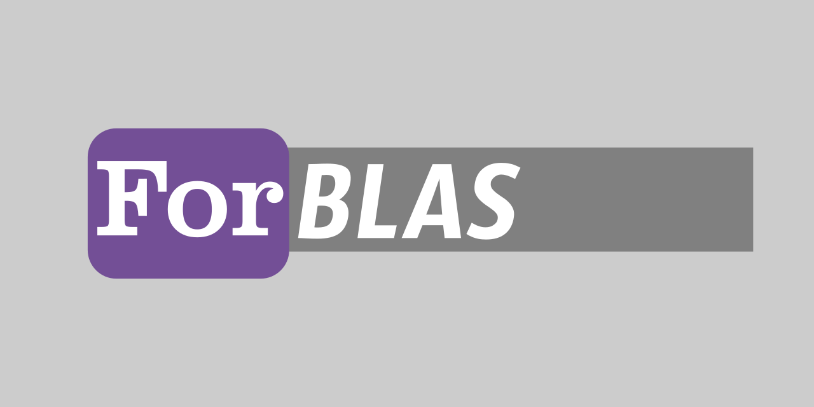

[](https://github.com/gha3mi/forblas)
[](https://github.com/gha3mi/forblas/blob/main/LICENSE)

**ForBLAS** simplifies the compilation of the latest [BLAS](https://github.com/Reference-LAPACK/lapack) library using the Fortran Package Manager (fpm).

<!--  -->

## Install Instructions

### 1. Prerequisites:

Ensure you have a Fortran compiler installed on your system.

### 2. Clone the Repository:

Clone the ForBLAS repository from GitHub, including submodules:

```shell
git clone --recurse-submodules https://github.com/gha3mi/forblas.git
cd forblas
git submodule update --init --recursive
```

### 3. Install BLAS Using fpm:

Install ForBLAS using [fpm](https://github.com/fortran-lang/fpm):

```shell
fpm install --profile release --prefix .
```

The compiled library will be located in the `lib` directory.

Adjust installation directory, compiler, and flags as needed:

- Use `--prefix <dir>` to set the installation directory.
- Use `--compiler <compiler>` to specify your Fortran compiler.
- Use `--flag '<flags>'` to customize compiler flags.

## Integrating BLAS in Your fpm Package

- Install and ForBLAS.
- Copy `libforblas.a` from the `lib` directory of ForBLAS to your fpm package's `lib` directory.
- Add `link = ["forblas"]` to your `fpm.toml` file.
- When using fpm, include `--flag '-Llib'` to specify the library directory.

## Running Tests

   ```shell
   fpm test
   ```

   ```shell
 Complex BLAS Test Program Results


 Test of subprogram number  1            CDOTC 
                                    ----- PASS -----

 Test of subprogram number  2            CDOTU 
                                    ----- PASS -----

 Test of subprogram number  3            CAXPY 
                                    ----- PASS -----

 Test of subprogram number  4            CCOPY 
                                    ----- PASS -----

 Test of subprogram number  5            CSWAP 
                                    ----- PASS -----

 Test of subprogram number  6            SCNRM2
                                    ----- PASS -----

 Test of subprogram number  7            SCASUM
                                    ----- PASS -----

 Test of subprogram number  8            CSCAL 
                                    ----- PASS -----

 Test of subprogram number  9            CSSCAL
                                    ----- PASS -----

 Test of subprogram number 10            ICAMAX
                                    ----- PASS -----
 Real BLAS Test Program Results


 Test of subprogram number  1             DDOT 
                                    ----- PASS -----

 Test of subprogram number  2            DAXPY 
                                    ----- PASS -----

 Test of subprogram number  3            DROTG 
                                    ----- PASS -----

 Test of subprogram number  4             DROT 
                                    ----- PASS -----

 Test of subprogram number  5            DCOPY 
                                    ----- PASS -----

 Test of subprogram number  6            DSWAP 
                                    ----- PASS -----

 Test of subprogram number  7            DNRM2 
                                    ----- PASS -----

 Test of subprogram number  8            DASUM 
                                    ----- PASS -----

 Test of subprogram number  9            DSCAL 
                                    ----- PASS -----

 Test of subprogram number 10            IDAMAX
                                    ----- PASS -----

 Test of subprogram number 11            DROTMG
                                    ----- PASS -----

 Test of subprogram number 12            DROTM 
                                    ----- PASS -----

 Test of subprogram number 13            DSDOT 
                                    ----- PASS -----
 Real BLAS Test Program Results


 Test of subprogram number  1             SDOT 
                                    ----- PASS -----

 Test of subprogram number  2            SAXPY 
                                    ----- PASS -----

 Test of subprogram number  3            SROTG 
                                    ----- PASS -----

 Test of subprogram number  4             SROT 
                                    ----- PASS -----

 Test of subprogram number  5            SCOPY 
                                    ----- PASS -----

 Test of subprogram number  6            SSWAP 
                                    ----- PASS -----

 Test of subprogram number  7            SNRM2 
                                    ----- PASS -----

 Test of subprogram number  8            SASUM 
                                    ----- PASS -----

 Test of subprogram number  9            SSCAL 
                                    ----- PASS -----

 Test of subprogram number 10            ISAMAX
                                    ----- PASS -----

 Test of subprogram number 11            SROTMG
                                    ----- PASS -----

 Test of subprogram number 12            SROTM 
                                    ----- PASS -----

 Test of subprogram number 13            SDSDOT
                                    ----- PASS -----
 Complex BLAS Test Program Results


 Test of subprogram number  1            ZDOTC 
                                    ----- PASS -----

 Test of subprogram number  2            ZDOTU 
                                    ----- PASS -----

 Test of subprogram number  3            ZAXPY 
                                    ----- PASS -----

 Test of subprogram number  4            ZCOPY 
                                    ----- PASS -----

 Test of subprogram number  5            ZSWAP 
                                    ----- PASS -----

 Test of subprogram number  6            DZNRM2
                                    ----- PASS -----

 Test of subprogram number  7            DZASUM
                                    ----- PASS -----

 Test of subprogram number  8            ZSCAL 
                                    ----- PASS -----

 Test of subprogram number  9            ZDSCAL
                                    ----- PASS -----

 Test of subprogram number 10            IZAMAX
                                    ----- PASS -----
```

## Contributing

Contributions to `ForBLAS` are welcome! If you find any issues or would like to suggest improvements, please open an issue or submit a pull request.
