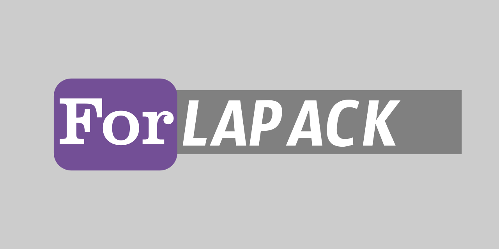

# ForLAPACK

[](https://github.com/gha3mi/forlapack)
[](https://github.com/gha3mi/forlapack/blob/main/LICENSE)

**ForLAPACK** simplifies the compilation of the latest [LAPACK](https://github.com/Reference-LAPACK/lapack) library using the Fortran Package Manager (fpm).

<!--  -->

## Install Instructions

### 1. Prerequisites:

Ensure you have a Fortran compiler installed on your system.

### 2. Clone the Repository:

Clone the ForLAPACK repository from GitHub, including submodules:

```shell
git clone --recurse-submodules https://github.com/gha3mi/forlapack.git
cd forlapack
git submodule update --init --recursive
```

### 3. Preparation:

Remove the `DEPRECATED` directory from LAPACK source code:

```shell
rm -r src/SRC/DEPRECATED
```

Copy the `src/INSTALL` directory to `src/SRC`:

```shell
cp -r src/INSTALL src/SRC
```

### 4. Install LAPACK Using fpm:

Install ForLAPACK using [fpm](https://github.com/fortran-lang/fpm):

```shell
fpm install --profile release --prefix .
```

The compiled library will be located in the `lib` directory.

Adjust installation directory, compiler, and flags as needed:

- Use `--prefix <dir>` to set the installation directory.
- Use `--compiler <compiler>` to specify your Fortran compiler.
- Use `--flag '<flags>'` to customize compiler flags.

## Integrating LAPACK and BLAS in Your fpm Package

- Install [ForBLAS](https://github.com/gha3mi/forblas) and ForLAPACK.
- Copy `libforblas.a` and `libforlapack.a` from the `lib` directory of ForBLAS and ForLAPACK to your fpm package's `lib` directory.
- Add `link = ["forlapack", "forblas"]` to your `fpm.toml` file.
- When using fpm, include `--flag '-Llib'` to specify the library directory.

## Contributing

Contributions to `ForLAPACK` are welcome! If you find any issues or would like to suggest improvements, please open an issue or submit a pull request.
